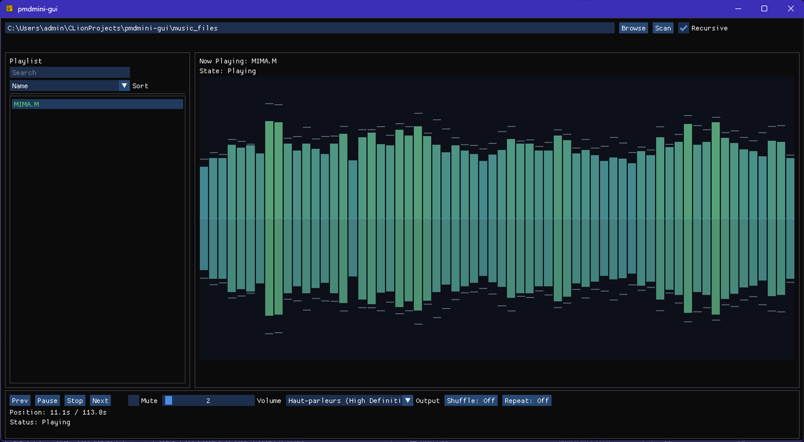

# pmdmini-gui 

GUI player for PC-98 PMD music files (.M/.M2) on Windows and Linux



## Features

- Plays .M and .M2 files (PC-98 PMD format YM2203/YM2608, OPN/OPNA)
- Plays .M26 and .M86 files too (PC-8801 support)
- Playlist with search and sorting
- Drag & drop support
- Waveform visualization
- Shuffle and repeat modes
- Config persistence
- Audio device selection


## Building

You can get the binary from the release page ! You don't have to build it manually.

### Linux

**Dependencies:**
```bash
sudo apt-get install cmake ninja-build g++ \
  libsdl2-dev libgl1-mesa-dev \
  libx11-dev libxrandr-dev libxinerama-dev libxcursor-dev libxi-dev
```

**Build:**
```bash
cmake -S . -B build -G Ninja -DCMAKE_BUILD_TYPE=Release
cmake --build build
./build/src/pmdmini-gui
```

### Windows (MinGW-w64)

**Dependencies:**

1. Install [MSYS2](https://www.msys2.org/)
2. Open MSYS2 MinGW64 terminal and install dependencies:
```bash
pacman -S mingw-w64-x86_64-gcc mingw-w64-x86_64-cmake mingw-w64-x86_64-SDL2
```
3. Add `C:\msys64\mingw64\bin` to your PATH

Alternatively, you can install MinGW-w64 standalone and SDL2 development libraries manually

**Build:**
```bash
cmake -S . -B build -G "MinGW Makefiles" -DCMAKE_BUILD_TYPE=Release
cmake --build build
```

The executable is statically linked, and located at `build/src/pmdmini-gui.exe`

### Offline builds

For offline builds with local pmdmini:
```bash
cmake -S . -B build -DPMDMINI_SOURCE_DIR=/path/to/pmdmini -DCMAKE_BUILD_TYPE=Release
```

## Usage

1. Browse to a directory or type the path
2. Click Scan (enable Recursive for subdirectories)
3. Double-click a track or drag .M/.M2/.M26/.M86 files into the window

Settings are saved to:
- Linux: `~/.config/pmdmini-gui/config.json`
- Windows: `%APPDATA%\pmdmini-gui\config.json`

## Known Issues

- Waveform viz is kinda broken
- Seeking reloads the whole track from start (slow on longer files) (Edit: I removed this for now)

## Note

All Touhou PC98 OSTs files were generously given to me by @niiroiwakura, thank you!

Github thinks this thing is written in C, probably because of the music files, I tried updating the .gitattributes to fix that but it doesn't seem to work

We also have a small Discord server ! **https://discord.gg/xyqZ86nawn**. Feel free to ask for help or questions about the project.

## License and Credits

BSD 3-Clause License. See LICENSE file for details.  
Uses [pmdmini](https://github.com/gzaffin/pmdmini) (modified BSD) and other open-source libraries. See individual dependencies for licenses.
