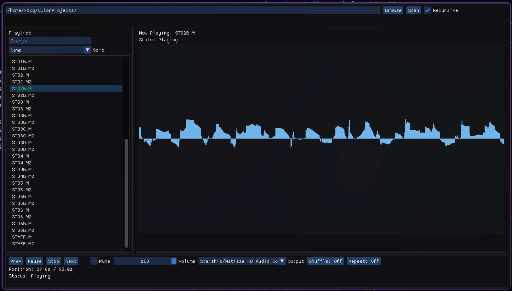

# pmdmini-gui

GUI player for PC-98 PMD music files (.M/.M2) on Linux



## Features

- Plays .M and .M2 files (PMD format)
- Playlist with search and sorting
- Drag & drop support
- Waveform visualization
- Shuffle and repeat modes
- Config persistence
- Audio device selection


## Building

**Dependencies (Ubuntu/Debian):**
```bash
sudo apt-get install cmake ninja-build g++ \
  libsdl2-dev libgl1-mesa-dev \
  libx11-dev libxrandr-dev libxinerama-dev libxcursor-dev libxi-dev
```

**Build:**
```bash
cmake -S . -B build -G Ninja
cmake --build build
./build/src/pmdmini-gui
```

For offline builds with local pmdmini:
```bash
cmake -S . -B build -G Ninja -DPMDMINI_SOURCE_DIR=/path/to/pmdmini
```

You can also grab binaries from the releases page.

## Usage

1. Browse to a directory or type the path
2. Click Scan (enable Recursive for subdirectories)
3. Double-click a track or drag .M/.M2 files into the window

Settings are saved to `~/.config/pmdmini-gui/config.json`.

Touhou 5 (Mystic Square) soundtrack included in `music_files/` to get started.

## Architecture

Decode thread writes to a ring buffer, SDL audio callback reads from it. Adds ~5s latency but no more clicks during file scans. Waveform samples from the same stream.

## Known Issues

- Waveform viz is kinda broken
- Seeking reloads the whole track from start (slow on longer files)

## Note

Made this because ZUN's PC-98 FM synthesis work is genuinely peak and the original PMD files deserve proper tooling.

## License and Credits

BSD 3-Clause License. See LICENSE file for details.  
Uses [pmdmini](https://github.com/digital-sound-antiques/pmdmini) (modified BSD) and other open-source libraries. See individual dependencies for licenses.
